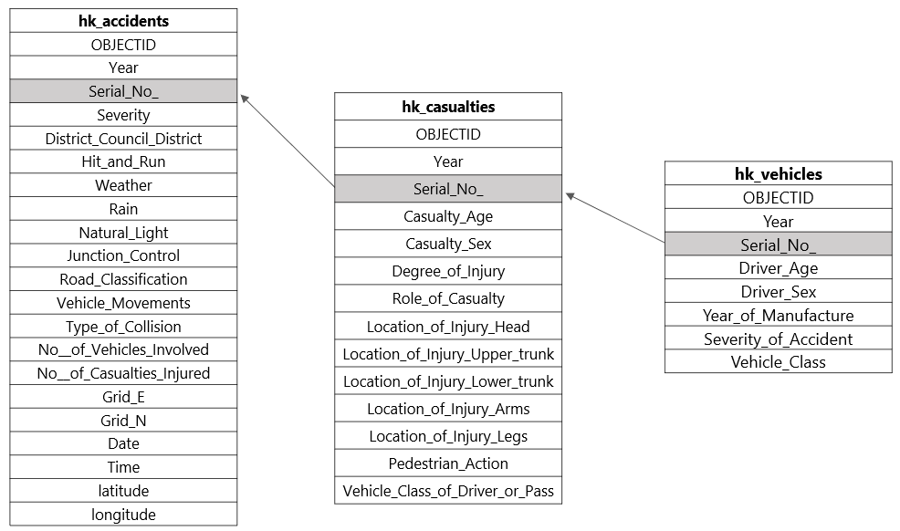

# hkdatasets
:package: An R data package containing datasets relating to Hong Kong


[](https://github.com/Hong-Kong-Districts-Info/hkdatasets/actions)


### :page_with_curl: Introduction

This package contains datasets on Hong Kong. This package is developed as part of the Hong Kong Districts Info group of projects, which is dedicated to using data science to help make public information more accessible and consumable. The package contains the following datasets:

- `hkdc` - A dataset containing information about Hong Kong District Councillors (elected 2019), with variables such as their constituency, region, share of vote, total votes, link to their Facebook pages, etc. (Sources: https://www.districtcouncils.gov.hk; https://dce2019.hk01.com/)

- `hk_accidents` - A dataset containing traffic accidents between 2014 and 2019.
- `hk_collisions` - A dataset containing information of collisions by casualties between 2014 and 2019.
- `hk_vehicles` - A dataset containing information of vehicles by casualties between 2014 and 2019.



The datasets `hk_accidents`, `hk_collisions`, and `hk_vehicles` are related and can be joined together using the variable `Serial_No_`. This dataset was made available via a Freedom of Information request to the [Hong Kong Transport Department](https://www.td.gov.hk/). We would also like to thank the authors behind the [{HK80}](https://cran.r-project.org/web/packages/HK80/index.html) package to enable us to convert the **HK1980GRID** coordinate system to longitudes and latitudes in the `hk_accidents` dataset. 

[Visit our GitHub](https://github.com/Hong-Kong-Districts-Info/hkdatasets)

### :wrench: Installation

{hkdatasets} is not released on CRAN (yet). 
You can install the latest development version from GitHub with:

```
install.packages("devtools")
devtools::install_github("Hong-Kong-Districts-Info/hkdatasets")
```

### :chart_with_upwards_trend: Datasets

If you are exploring the package, we recommend starting with 2019 District Councillors dataset:

```
library(hkdatasets)
head(hkdc)
```
To find out more about the variable and the source of the dataset, you can run:
```
?hkdc
```
Note: this dataset contains Chinese characters in the UTF-8 encoding. 

### :mailbox_with_mail: Contact
Please feel free to submit suggestions and report bugs: https://github.com/Hong-Kong-Districts-Info/hkdatasets/issues

Also check out our [website](https://hong-kong-districts-info.github.io/) for our other work and projects!
